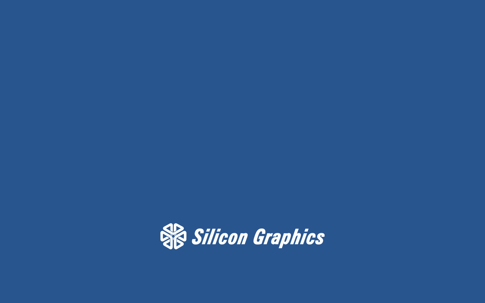

# SGI Indigo — SDDM theme

A Silicon Graphics styled greeter, matched to the desktop lock screen so the
machine looks the same before and after login.



## Provenance

This is a **re-skin, not a rewrite**. It is derived from
[JaKooLit/simple-sddm](https://github.com/JaKooLit/simple-sddm) (the Qt5
variant, which was itself derived from tokyo-night-sddm by rototrash), and is
GPL-3.0-or-later like its parent. Upstream `LICENSE`, `COPYING` and
`README.upstream.md` are kept in this directory.

What actually differs from upstream:

| | |
|---|---|
| `Main.qml`, `Components/`, `Assets/` | **unmodified** |
| `theme.conf` | re-coloured to the SGI palette, form centred |
| `Backgrounds/` | five stock images removed (2.3 MB); replaced with `sgi-indigo.png` |
| `metadata.desktop`, `README.md`, `preview.png` | this theme |

Keeping the QML untouched means upstream fixes can be pulled in by copying the
QML back over, without losing the styling.

**This is a Qt5 theme.** It needs `qml-module-qtquick-controls2`,
`qml-module-qtgraphicaleffects`, `qml-module-qtquick-layouts` and `libqt5svg5`
(all present on this machine), and it runs under `/usr/bin/sddm-greeter`, not
`sddm-greeter-qt6`.

## Palette

Sampled from `~/Pictures/Wallpaper/indigo.png`, which is 89% one flat colour:

| role | colour | |
|---|---|---|
| SGI field blue | `#29558e` | the background, straight from the wallpaper |
| deep indigo | `#14294d` | `BackgroundColor`, and the login button text |
| white | `#ffffff` | `MainColor` — text and idle borders |
| light blue | `#8fc0ff` | `AccentColor` — focus and hover |

The same values drive the lock screen (`.config/swaylock/config` and
`.config/swaylock-effects/config`), so the greeter and the lock match.

## The background

`Backgrounds/sgi-indigo.png` is generated, not hand-made:

```sh
~/.config/scripts/lock-background.py --size 2560x1600
cp ~/.cache/sgi-lock/2560x1600.png Backgrounds/sgi-indigo.png
```

That script lifts the white logo out of the wallpaper as an alpha mask and
re-composites it at the requested size, so it stays crisp instead of being
upscaled from the 1280x800 original.

It is rendered at 2560x1600 (16:10) and committed **into the theme** rather
than referenced from `~/.cache`, because **SDDM runs as the `sddm` user and
cannot read your home directory**. A background path under `/home/tom` silently
gives you a blank screen.

`ScaleImageCropped="true"` handles the aspect difference on a 16:9 panel; the
logo sits in the upper third, so cropping top and bottom doesn't clip it.

## Installing

SDDM only looks in `/usr/share/sddm/themes`, so the theme is symlinked there
from the repo — edits are then live without copying anything:

```sh
sudo ln -sfn ~/doots/.config/sddm/sgi-sddm /usr/share/sddm/themes/sgi-sddm
sudo tee /etc/sddm.conf.d/theme.conf.user >/dev/null <<'EOF'
[Theme]
Current=sgi-sddm
EOF
```

Preview it without logging out:

```sh
sddm-greeter --test-mode --theme /usr/share/sddm/themes/sgi-sddm
```

## Fonts

`Font="JetBrainsMono Nerd Font"` has to be readable by the **`sddm` user**, not
just by you. Fonts under `~/.local/share/fonts` are not — that is where this
machine keeps them, so they are additionally installed to
`/usr/local/share/fonts` for the greeter. If the greeter falls back to a
default sans, that link is what broke.

## Rolling back

The previous setting is backed up at
`/etc/sddm.conf.d/theme.conf.user.bak-simple-sddm`:

```sh
sudo cp /etc/sddm.conf.d/theme.conf.user.bak-simple-sddm \
        /etc/sddm.conf.d/theme.conf.user
```

If a theme fails to load, SDDM falls back to its own built-in greeter rather
than refusing to start, so a broken theme means an ugly login — not a locked-out
machine. You can also switch from a TTY (`Ctrl+Alt+F3`) if the greeter is
unusable.

## Known upstream warnings

`sddm-greeter --test-mode` prints these. All of them are **also produced by the
unmodified upstream theme** — the QML here is untouched, so they are not
introduced by this re-skin:

```
Components/SystemButtons.qml:70:13: Unable to assign [undefined] to QQuickItem*
Components/SessionButton.qml:38:5:  Unable to assign ComboBox to Control
Main.qml:34/35: ReferenceError: Screen is not defined
```

`module "QtQuick.VirtualKeyboard" is not installed` was also in that list; this
theme sets `ForceHideVirtualKeyboardButton="true"` since the module genuinely
isn't installed here, which stops the greeter offering a button that can't work.
